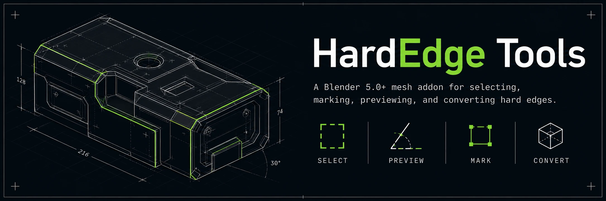
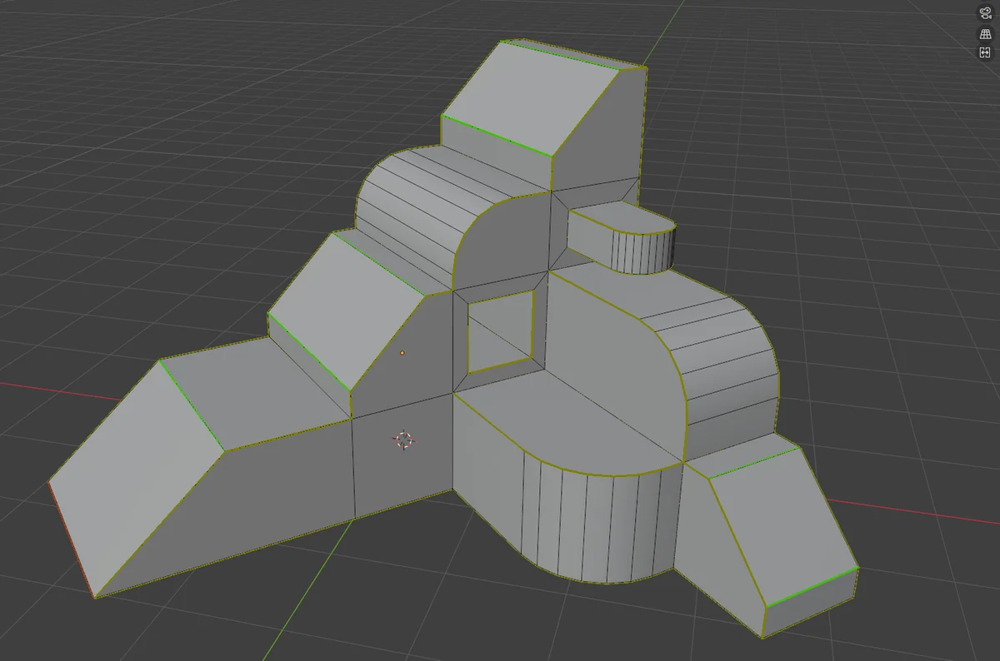
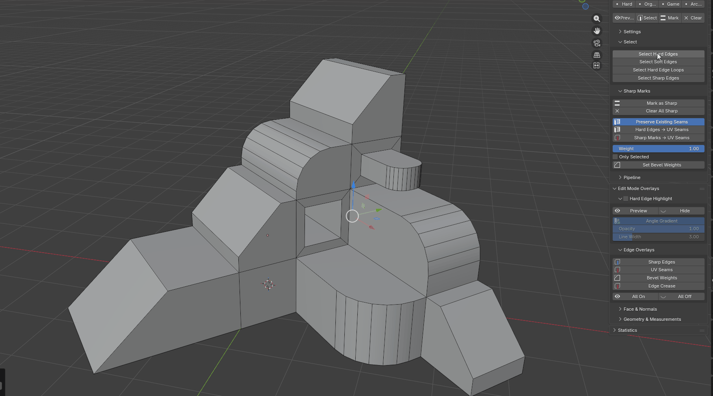
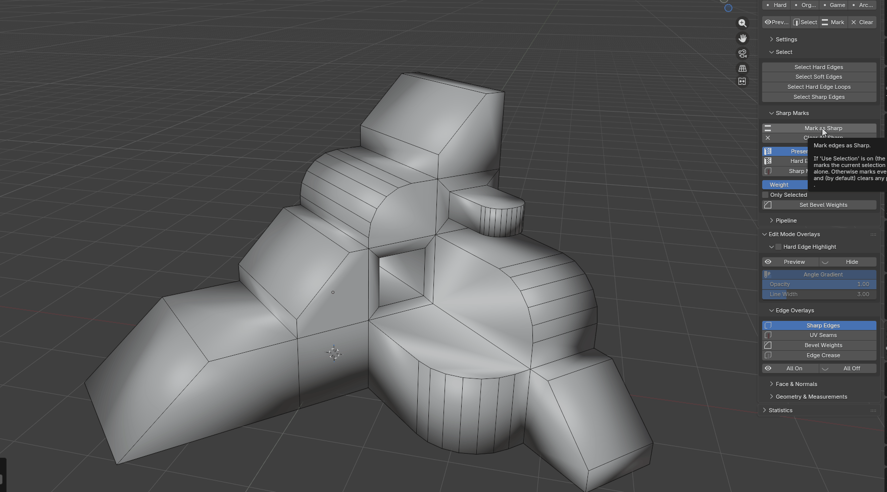
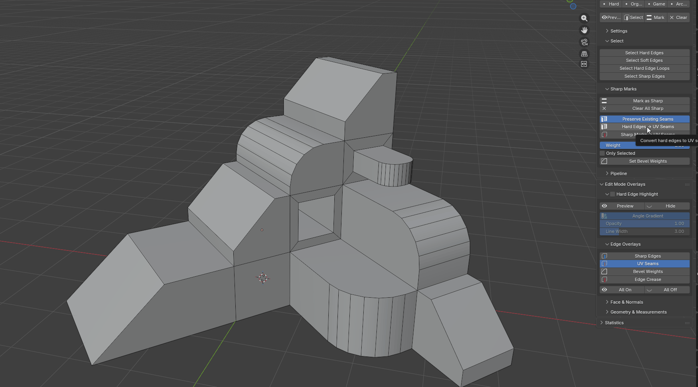
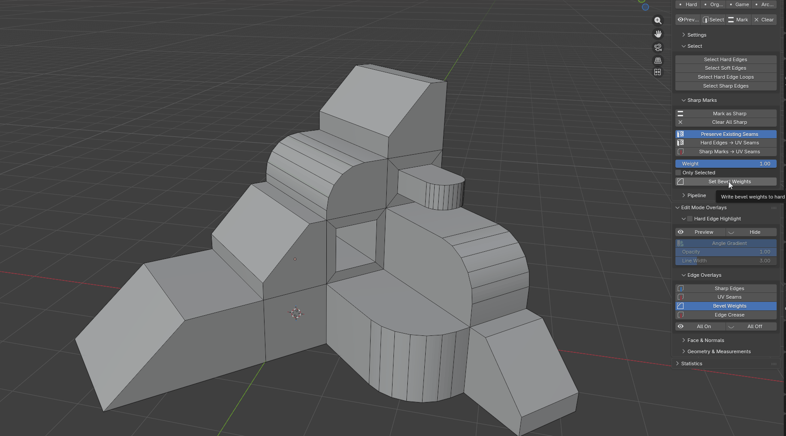

  

  
  
  

# HardEdge Tools

A Blender 5.0+ mesh addon for **selecting, marking, previewing, and converting hard edges** in edit mode — with a live viewport overlay and a game-ready prep pipeline.

  

## Highlights

- **Angle-based selection** — find hard edges by the angle between adjacent faces, with optional boundary edges and length filtering.
- **Non-destructive preview** — inspect matching edges before touching your selection; toggle it off just as fast.
- **Mark & convert** — mark Sharp, push to UV seams, or assign bevel weights, all while preserving your existing seam layout by default.
- **Viewport overlay** — a green→red gradient highlight shows edge hardness at a glance, plus optional edge/face measurements.
- **Game-ready pipeline** — batch sharp-marking and one-click prep for clean exports.
- Lives in `View3D > Sidebar > Hard Edges` and the **Ctrl+E** edge menu.

## Install

1. Download `hardedge_tools-2.2.1.zip` (or zip the `hardedge_tools` folder).
2. In Blender: `Edit > Preferences > Add-ons > Install…`
3. Choose the zip and enable **HardEdge Tools**.
4. Enter edit mode on a mesh and open the **Hard Edges** sidebar tab.

## Basic Workflow

1. Set the angle threshold in the Hard Edges panel.
2. **Preview** to inspect matching edges, then **Select** to grab them.
3. **Mark** them Sharp, or send them to **UV Seams** / **Bevel Weights**.
4. Run **Game-Ready Prep** when you're ready to export.

## Functions

Each clip is captured live in Blender — the sidebar panel and the resulting edges.

| | |
|---|---|
| **Select Hard Edges** — select every edge over the angle threshold | **Mark as Sharp** — flat normals → marked Sharp fixes the shading (cyan) |
|  |  |
| **Hard Edges → UV Seams** — convert hard edges to seams (red) | **Set Bevel Weights** — assign bevel weight to hard edges (blue) |
|  |  |

## License

See [LICENSE](LICENSE)